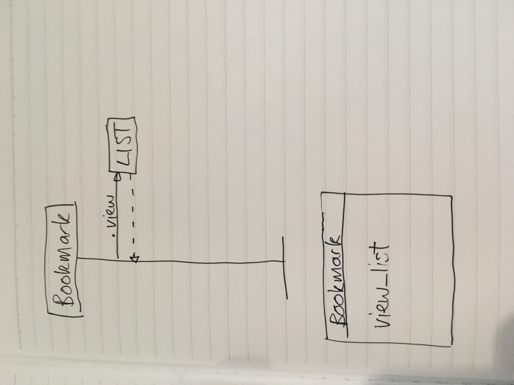

# Bookmark Manager

### User stories

```
User story 1

As an internet user,
So that I can find all of my favourite websites when I need them,
I want to be able to view a list of my bookmarked urls.
```

### Domain model


